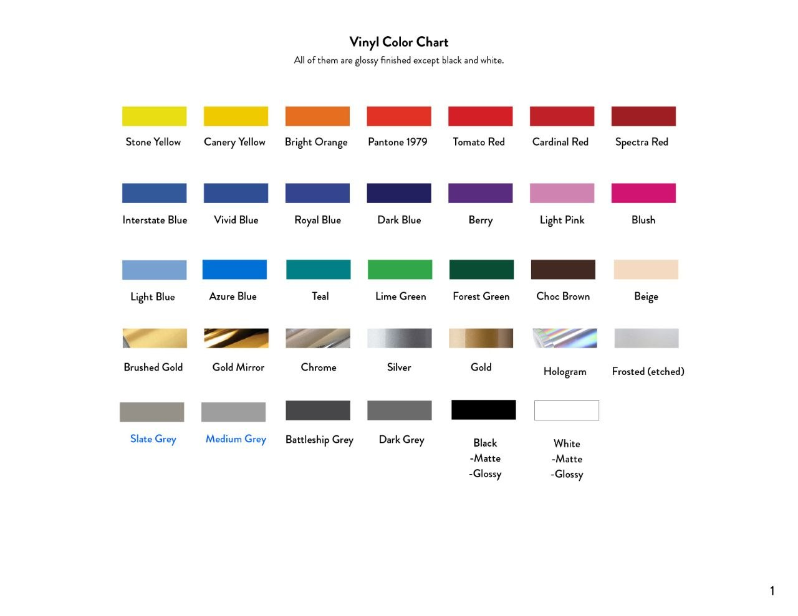

# 材料参考

> 常用材料规格及用途

---

## PVC 板（Foam PVC）

| 厚度 | 用途 |
|------|------|
| **1/8"** | 活动板、A字板（A-Frame）图形或替换面，可贴 Vinyl |
| **1/2"** | 太厚只能 CNC 切割，多数用于广告招牌制作 |

---

## 亚克力板（Acrylic / Plexiglass）

| 厚度 | 用途 |
|------|------|
| **1/8"** | 薄板，适用小标牌 |
| **1/4"** | 灯箱制作（常用），白色/黑色/透明 |
| **1/2"** | 厚重标牌 |

- 切割方式：**激光镭射切割**
- 常用颜色：白色、黑色、透明

---

## 铝片（Aluminum）

| 厚度 | 用途 |
|------|------|
| **0.040"** | 常用厚度，贴 Vinyl 制作各种牌子 |
| **0.060"** | 更厚更坚固，适合大型/户外标牌 |

---

## Vinyl 颜色参考

> 除 Black / White 外，默认全部 **Glossy** 光面。

| 色系 | 颜色 |
|------|------|
| 🟡 黄/橙/红 | Stone Yellow · Canary Yellow · Bright Orange · Pantone 1979 · Tomato Red · Cardinal Red · Spectra Red |
| 🔵 蓝/紫/粉 | Interstate Blue · Vivid Blue · Royal Blue · Dark Blue · Berry · Light Pink · Blush |
| 🟢 浅蓝/绿/棕 | Light Blue · Azure Blue · Teal · Lime Green · Forest Green · Choc Brown · Beige |
| ✨ 金属/特殊 | Brushed Gold · Gold Mirror · Chrome · Silver · Gold · Hologram · Frosted (etched) |
| ⚫ 灰/黑/白 | Slate Grey · Medium Grey · Battleship Grey · Dark Grey · Black（-Matte / -Glossy）· White（-Matte / -Glossy） |

---

## 供应商链接

| 供应商 | 链接 |
|--------|------|
| **HDR PRINTING**（印刷外包参考） | https://hdrprint.com/products/banners |
